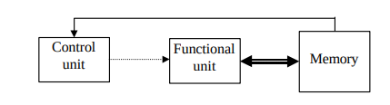
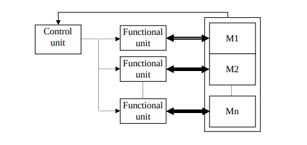
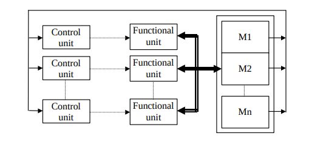
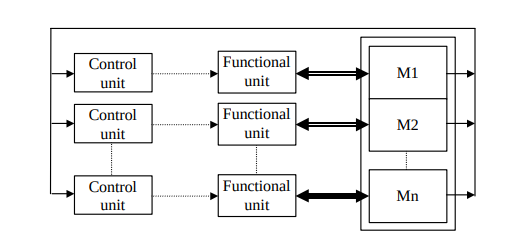

  

# 💻 Classificação de Hardware com várias CPUs 💻

A classificação de hardware de sistemas com várias CPUs é feita com base em algumas características
## Organização e distribuição do sistema de memória
- Memória compartilhada (shared memory):
	- o espaço de endereçamento é único;
	- comunicação através de load e store nos endereços de memória.
- Memória privativa (multiple private address space):
	- o espaço de endereços é distinto para cada processador;
	- comunicação através de troca de mensagens com operações 	send e receive.
- Memória distribuída (distributed memory)
	- a memória é composta por vários módulos;
	- cada módulo está próximo a um processador.
- Memória centralizada (centralized memory) 
	- a memória se encontra a mesma distância de todos os processadores;
	- pode ser implementada com um ou vários módulos

A classificação mais aceita dos ambientes de hardware com várias CPUs é a conhecida como Taxonomia de Flynn. 

## Taxonomia de Flynn

- SISD: único fluxo de instruções e um único fluxo de dados. Todos os
computadores monoprocessados tradicionais estão nesta categoria;

 
- SIMD: um único fluxo de instruções e múltiplos fluxos de dados.
	- verdadeiramente SIMD ou “vector (array) computer” (exemplos:
ILLIAC IV, GF11, Connection Machine)
	- “pipelined SIMD” (exemplos: CRAY-1, CDC Cyber, NEC SX)

- MISD: múltiplo fluxo de instruções e um único fluxo de dados.
Nenhuma máquina funciona neste modelo;

- MIMD: múltiplo fluxo de instruções e múltiplo fluxo de dados:

  - Multiprocessadores
  - Multicomputadores
 
  
  
  
  ## Multiprocessadores
Computador paralelo onde todas as CPUs compartilham uma memória comum. são divididos em três tipos de, distinguidos pelo modo como a memória compartilhada é implementada.
- Multiprocessadores UMA (Uniform Memory Access – Acesso à Memória Uniforme).
- Multiprocessadores NUMA (NonUniform MemoryAccess – Acesso Não-Uniforme à Memória).
- Multiprocessadores COMA (Cache Only MemoryAccess – Acesso Somente à Memória Cache).

 ## Multicomputadores
Computador paralelo construído com múltiplos computadores interligados por uma rede, onde cada processador possui sua própria memória local.
- MPP (Massively Parallel Processors - Processadores Massivamente Paralelos)
- COW (Cluster of Workstations - Cluster de Estações de Trabalho)
